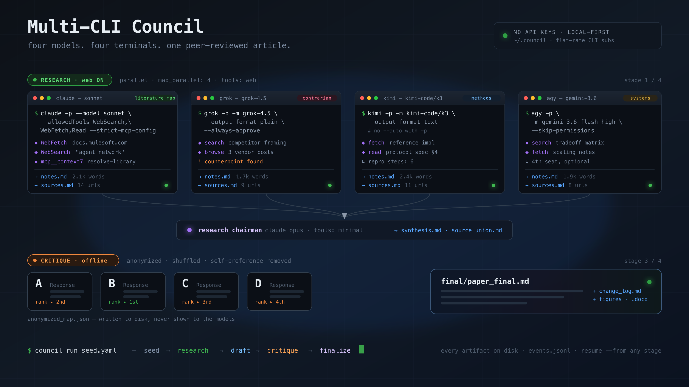

# Multi-CLI Council

**Inspired by [Andrej Karpathy's LLM Council](https://github.com/karpathy/llm-council).**




A multi-model council for research and blog articles, rebuilt for **CLI backends** instead of OpenRouter and a **paper/blog pipeline** instead of single-question Q&A. You give it **main points + a few seed links**; it **researches** (required, with web tools), **drafts**, **critiques**, and **finalizes** a document. After that, separate commands export **Markdown / Word** and generate **figures**.

No provider APIs — the app shells out to CLIs you already subscribe to:

| Provider | CLI | Default models (see `config.yaml`) |
|----------|-----|-------------------------------------|
| **Claude** | `claude -p` | **sonnet** = research gather · **opus** = research summary + critique + image planning · **fable** = draft + finalize |
| **Grok** | `grok -p` | `grok-4.5` |
| **Kimi** | `kimi -p` | `kimi-code/k3` |
| **Antigravity** | `agy -p` | `gemini-3.6-flash-high` (also flash / Claude / GPT-OSS ids via `agy models`) |

---

## Table of contents

1. [How it works](#how-it-works)
2. [Install](#install)
3. [Quick start](#quick-start)
4. [Commands reference](#commands-reference)
5. [End-to-end workflow](#end-to-end-workflow)
6. [Seed input format](#seed-input-format)
7. [Model routing](#model-routing)
8. [Output formats](#output-formats)
9. [Images](#images)
10. [Session layout](#session-layout)
11. [Configuration](#configuration)
12. [Tools & MCP servers](#tools--mcp-servers)
13. [Web UI](#web-ui)
14. [Troubleshooting](#troubleshooting)
15. [Development](#development)

---

## How it works

```
seed → research* → draft → critique → finalize
         ↑ always on
                              ↓ (separate commands)
                    export (md | word) · images
```

| Stage | What happens | Who runs |
|-------|----------------|----------|
| **Seed** | Normalize title, main points, links, goals | Local only |
| **Research** | Open seed links, find similar sources, write notes | Sonnet + Grok + Kimi + Antigravity (parallel, web tools ON) |
| **Research chairman** | Merge notes into one synthesis | Claude **opus** |
| **Draft** | First full article from synthesis | Claude **fable** |
| **Critique** | Independent reviews → anonymized peer rank | Opus + Grok + Kimi + Antigravity |
| **Critique chairman** | Council critique report | Claude **opus** |
| **Finalize** | Revised article + change log | Claude **fable** |
| **Export** *(command)* | Markdown and/or Word | Local (`python-docx`) |
| **Images** *(command)* | Plan figures, write SVG + prompts | Claude **opus** planner |

Every intermediate file is saved under `data/sessions/{id}/` and streamed to the terminal / Web UI.

---

## Install

**Requirements**

- Python 3.11+
- [uv](https://github.com/astral-sh/uv) (recommended)
- Logged-in CLIs on your `PATH`: `claude`, `grok`, `kimi`, and optionally `agy` (Antigravity)

```bash
cd multi-cli-council
uv venv && source .venv/bin/activate
uv pip install -e .

# Smoke-check CLIs (use recognized aliases)
claude -p "hi" --model sonnet --output-format text
grok -p "hi" -m grok-4.5 --output-format plain --always-approve
kimi -p "hi" -m kimi-code/k3 --output-format text
agy -p "hi" --model gemini-3.6-flash-low --output-format text --dangerously-skip-permissions

# Verify council config + binaries
council doctor
council version
```

Optional local overrides (never commit secrets):

```bash
cp config.yaml config.local.yaml   # edit models / timeouts here
```

---

## Quick start

```bash
# 1. Run a full council session from an example seed
council run examples/seed.example.yaml

# 2. Watch progress / open artifacts
council list
council show <session_id>
council serve   # http://127.0.0.1:8765

# 3. After finalize succeeds
council word <session_id>              # Word .docx
council images <session_id>            # figures
```

Compose a run without a seed file:

```bash
council run \
  --title "MuleSoft Agent Network 2.0" \
  --points ./my-points.md \
  --links 'https://docs.mulesoft.com/...,https://...' \
  --goal 'Blog article 3000-3500 words' \
  --goal 'Sound human, not AI-generic'
```

---

## Commands reference

All commands accept `--config` / `-c` to point at an alternate `config.yaml`.

### `council doctor`

Check that CLIs are on `PATH` and print resolved provider / member / role models.

```bash
council doctor
council doctor -c ./config.local.yaml
```

### `council version`

```bash
council version
```

### `council run`

Start a full pipeline (research is always required).

```bash
council run [SEED_FILE] [OPTIONS]
```

| Argument / option | Description |
|-------------------|-------------|
| `SEED_FILE` | Optional `seed.yaml` or `seed.md` |
| `--points PATH` | Markdown/text file of main points |
| `--links STR` | Comma-separated seed URLs |
| `--links-file PATH` | One URL per line |
| `--title` / `-t` | Working title / research question |
| `--goal` / `-g` | Goal or constraint (repeatable) |
| `--from STAGE` | Start at `seed` \| `research` \| `draft` \| `critique` \| `finalize` (default: `seed`) |
| `--session ID` | Reuse a specific session id |
| `--config` / `-c` | Config path |

Examples:

```bash
council run examples/seed.example.yaml
council run examples/seed.example.md
council run --points notes.md --links-file links.txt -t "My topic" -g "Workshop tone"
council run seed.yaml --from research --session 8cafb4df8434
```

### `council resume`

Continue an existing session from a stage (seed must already exist on disk).

```bash
council resume <session_id> --from draft
council resume <session_id> --from research
council resume <session_id> --from critique
council resume <session_id> --from finalize
```

| Option | Description |
|--------|-------------|
| `--from STAGE` | Stage to start from (default: `research`) |

### `council list`

List sessions (newest first).

```bash
council list
```

### `council show`

Show session metadata, artifacts, or print one artifact as Markdown.

```bash
council show <session_id>
council show <session_id> -a research/synthesis.md
council show <session_id> -a draft/paper_v1.md
council show <session_id> -a critique/chairman_report.md
council show <session_id> -a final/paper_final.md
council show <session_id> -a final/images/index.md
```

| Option | Description |
|--------|-------------|
| `--artifact` / `-a` | Relative path under the session directory |

### `council export`

Export the final paper as **Markdown** or **Word**.

```bash
council export <session_id> --format md
council export <session_id> --format word
council export <session_id> -f docx -o ~/Desktop/article.docx
```

| Option | Description |
|--------|-------------|
| `--format` / `-f` | `md` (default) \| `docx` \| `word` |
| `--out` / `-o` | Output file path (optional; default under `export/`) |
| `--with-images` | Prefer `paper_with_figures.md` and embed PNGs (for Word) |
| `--generate-images` | Generate figures first if missing |

### `council word`

Shortcut for Word export (`export -f word`). Use **`--with-images`** to embed figures.

```bash
council word <session_id>
council word <session_id> -o ~/Desktop/article.docx

# Embed PNGs from council images
council word <session_id> --with-images
council word <session_id> --with-images -o ~/Desktop/article-with-figures.docx

# Generate figures first if missing, then embed into Word
council word <session_id> --with-images --generate-images
```

| Option | Description |
|--------|-------------|
| `--out` / `-o` | Output `.docx` path |
| `--with-images` | Use `paper_with_figures.md` and embed figure PNGs |
| `--generate-images` | Run image generation if figures are missing (implies images) |

### `council images`

**Post-finalize only.** Plan and generate figures for the final paper.

```bash
council images <session_id>
council images <session_id> -n 5
council images <session_id> -n 4 --style "flat technical diagram, blue accents"
```

| Option | Description |
|--------|-------------|
| `--count` / `-n` | Number of figures (default: `images.default_count` in config) |
| `--style` | Style guidance for prompts / SVGs |

Does **not** run inside `council run`. Requires `final/paper_final.md` (or a valid draft fallback).

### `council serve`

Start the local Web UI (FastAPI + live SSE).

```bash
council serve
council serve --host 127.0.0.1 --port 8765
```

| Option | Description |
|--------|-------------|
| `--host` | Bind host (default from config: `127.0.0.1`) |
| `--port` / `-p` | Port (default: `8765`) |

Open **http://127.0.0.1:8765**

---

## End-to-end workflow

```bash
# A. Full pipeline from seed
council run examples/seed.example.yaml
# → note the session id printed, e.g. 8cafb4df8434

# B. If something failed mid-way
council resume 8cafb4df8434 --from draft

# C. Inspect intermediates
council show 8cafb4df8434
council show 8cafb4df8434 -a research/synthesis.md
council show 8cafb4df8434 -a final/paper_final.md

# D. Deliverables
council export 8cafb4df8434 -f md
council word 8cafb4df8434 -o ~/Desktop/article.docx

# E. Figures, then Word with figures embedded
council images 8cafb4df8434 -n 4
council word 8cafb4df8434 --with-images -o ~/Desktop/article-with-figures.docx

# One-shot: generate figures if missing AND write Word with embeds
council word 8cafb4df8434 --with-images --generate-images

# F. Optional: live UI during/after a run
council serve
```

---

## Seed input format

### YAML (`examples/seed.example.yaml`)

```yaml
title: "Working title or research question"

main_points:
  - "Claim or angle 1"
  - "Claim or angle 2"

seed_links:
  - "https://example.com/doc-1"
  - "https://example.com/doc-2"

goals:
  - "Blog article 3000–3500 words"
  - "Sound human, not AI-generic"

constraints:
  - "Prefer official docs"
```

### Markdown (`examples/seed.example.md`)

```markdown
# Working title

## Main points
- Claim or angle 1
- Claim or angle 2

## Links
- https://example.com/doc-1

## Goals
- Blog article tone
```

You do **not** need a finished paper — only bullets + a few links.

---

## Model routing

Claude is split by role (not one model for everything):

| Role | Model | Purpose |
|------|--------|---------|
| Research gather | **sonnet** | Web search / source map |
| Research chairman | **opus** | Summarize multi-model research |
| Critique peer | **opus** (`critic_claude`) | Paper critique — **not** sonnet |
| Critique chairman | **opus** | Merge critiques |
| Image planner | **opus** | Figure plan after finalize |
| Draft writer | **fable** | Long-form draft |
| Finalize | **fable** | Final revision |

| Role | Model |
|------|--------|
| Research + critique peer | Grok **grok-4.5** |
| Research + critique peer | Kimi **kimi-code/k3** |
| Research + critique peer | Antigravity **gemini-3.6-flash-high** (`agy`) |

**Claude aliases that work with Claude Code:** `sonnet`, `opus`, `fable`  
(or full ids like `claude-fable-5`). Do **not** use `fable5` / `sonnet5` — they are not recognized.

**Antigravity model ids:** run `agy models` (e.g. `gemini-3.6-flash-high`, `claude-opus-4-6-thinking`).

To drop Antigravity and run the original three-vendor council, remove
`researcher_antigravity` from `roles.research.participants` and
`roles.critique.participants` in `config.yaml`.

> **Tool-mode caveats:** role `tools` modes (`web` / `minimal` / `off`) are enforced for Claude and Grok via CLI flags. **Kimi** and **Antigravity** have no such flags, so they run with their CLI-default tool set in every stage.

Edit seats anytime in `config.yaml` (or `config.local.yaml`).

Each seat's **capabilities** are separate from its model — see
[Tools & MCP servers](#tools--mcp-servers) for web access and MCP wiring.

---

## Output formats

| Format | Produced by | Location |
|--------|-------------|----------|
| **Markdown** (default) | Finalize always; also `council export -f md` | `final/paper_final.md`, `export/paper_final.md` |
| **Word (.docx)** | `council word` or `council export -f word` | `export/paper_final.docx` (or `--out`) |
| **Word + figures** | `council word --with-images` | `export/paper_with_figures.docx` |

Config:

```yaml
output:
  default_format: md          # md | docx
  auto_export:                # written under export/ when finalize succeeds
    - md
    # - docx                  # uncomment to auto-write Word after finalize
```

Word export uses `python-docx` (bundled). If missing, install with `uv pip install python-docx`. Pandoc is an optional fallback when available.

---

## Images

`council images` is a **separate post-step** after the final article exists.

1. Claude **opus** reads the final paper and plans N figures (JSON).  
2. For each figure, the tool writes:
   - `figure_XX.png` — **Word-embeddable** diagram (Pillow)
   - `figure_XX.svg` — vector diagram (browser / design tools)
   - `figure_XX.prompt.md` — prompt for external image generators  
3. Also writes `final/images/index.md` and `final/paper_with_figures.md`.

```bash
council images <session_id>
council images <session_id> -n 6 --style "isometric product diagram"

# Embed into Word
council word <session_id> --with-images -o ~/Desktop/out.docx

# One command: generate figures if needed + Word with embeds
council word <session_id> --with-images --generate-images -o ~/Desktop/out.docx
```

Config:

```yaml
images:
  default_count: 4
  style: "clean technical blog illustration, flat vector, high contrast, professional"
  include_svg: true
  include_prompts: true

roles:
  image_planner:
    provider: claude
    model: opus
```

---

## Session layout

```
data/sessions/{id}/
  session.json                 # status, stages, artifact index
  events.jsonl                 # live timeline (CLI + Web UI)
  input/
    seed.yaml
    points.md
    links.txt
    goals.md
  research/
    researcher_claude/notes.md
    researcher_grok/notes.md
    researcher_kimi/notes.md
    {member}/sources.md        # URLs extracted per researcher
    {member}/raw_log.txt       # argv + stdout/stderr per invoke
    _chairman/                 # research chairman work dir
    synthesis.md
    source_union.md
    bundle.md
  draft/
    paper_v1.md
    claims_trace.md
  critique/
    independent/*.md
    anonymized/{A..Z}.md       # per-letter anonymized copies
    peer_reviews/*.md
    anonymized_map.json
    _chairman/                 # critique chairman work dir
    chairman_report.md
  final/
    paper_final.md
    full_output.md             # raw finalize output (debug)
    revision_plan.md
    change_log.md
    paper_with_figures.md      # after council images
    images/
      plan.json
      plan.md
      planner_raw.md           # raw planner output (debug)
      index.md
      figure_01.png            # Word-embeddable
      figure_01.svg
      figure_01.prompt.md      # if images.include_prompts
  export/
    paper_final.md             # after export / auto_export
    paper_final.docx           # after council word
    paper_with_figures.docx    # after council word --with-images
```

Every model invocation also leaves a scratch `_invoke/` dir (prompt.txt) inside its work dir — debugging only, safe to ignore.

---

## Configuration

Primary file: **`config.yaml`** in the project root.  
Optional merge override: **`config.local.yaml`** (same keys; deep-merged).

Important sections:

| Key | Purpose |
|-----|---------|
| `providers.*` | Binary names, default models, extra CLI flags |
| `providers.claude.mcp_servers` | Opt-in MCP servers — see [Tools & MCP servers](#tools--mcp-servers) |
| `members.*` | Named seats (sonnet researcher, opus critic, grok, kimi) |
| `roles.*` | Stage tools, timeouts, participants, chairman models |
| `roles.<stage>.tools` | Capability level: `web` \| `minimal` \| `"off"` |
| `pipeline.stages` | Stage filter (execution order is fixed: seed → research → draft → critique → finalize); `research_required: true` |
| `output.*` | Default format + auto-export list |
| `images.*` | Default figure count / style |
| `storage.sessions_dir` | Where sessions are stored |
| `server.host` / `server.port` | Web UI bind address |
| `invoke.retries` / `max_parallel` | Process invocation policy |

Prompts live in `prompts/` and can be edited without code changes:

- `research.md`, `research_chairman.md`
- `draft.md`
- `critique.md`, `peer_review.md`, `critique_chairman.md`
- `finalize.md`
- `images_plan.md`

---

## Tools & MCP servers

Everything here is **configuration only** — the `council` commands do not change.
There are no `--tools` or `--mcp` CLI flags; the pipeline reads `config.yaml` and
builds each CLI invocation itself.

### Tool modes

Every stage runs at one of three capability levels, set by `roles.<stage>.tools`:

| Mode | Claude gets | Network? | Default stages |
|------|-------------|----------|----------------|
| `web` | `WebSearch`, `WebFetch`, `Read`, `Glob`, `Grep` (permission-mode `auto`) | **yes** | `research` |
| `minimal` | `Read`, `Glob`, `Grep` (permission-mode `dontAsk`) | no | `draft_writer`, `finalize`, `research_chairman`, `critique`, `image_planner` |
| `"off"` | nothing | no | `critique_chairman` |

> `"off"` **must be quoted** — bare `off` is YAML `false` and fails validation.

### Giving another stage web access

Change that stage's `tools`. To let `finalize` re-check links before publishing:

```yaml
roles:
  finalize:
    provider: claude
    model: fable
    tools: web            # was: minimal
    timeout_seconds: 1200
```

Do this deliberately. A `web` stage fetches untrusted pages, and critique is
offline on purpose so reviews are reproducible and can't be steered by a page
the model happens to load.

### Enabling MCP servers

MCP is **Claude-only** — the `grok`, `kimi`, and `agy` CLIs have no equivalent
flag, and listing `mcp_servers` under them is a hard config error rather than a
silent no-op.

Your global/user MCP servers are **not** inherited. The adapter always passes
`--strict-mcp-config`, so only servers listed here load. That keeps runs
reproducible across machines and keeps critics genuinely isolated.

```yaml
providers:
  claude:
    bin: claude
    default_model: sonnet
    mcp_servers:
      context7:                                    # stdio server
        command: npx
        args: ["-y", "@upstash/context7-mcp"]
        tool_modes: [web]                          # research only
      sequential-thinking:
        command: npx
        args: ["-y", "@modelcontextprotocol/server-sequential-thinking"]
        tool_modes: [web, minimal]                 # also during draft/finalize
      ref:                                         # HTTP server
        url: https://api.ref.tools/mcp
        tool_modes: [web]
        enabled: false                             # keep entry, switch off
```

| Field | Purpose |
|-------|---------|
| `command` / `args` / `env` | stdio server (standard MCP shape) |
| `url` | HTTP server (instead of `command`) |
| `tool_modes` | Which tool modes load this server. Omit = all modes |
| `enabled` | `false` disables without deleting the entry |

**`tool_modes` is the important control.** It maps to tool modes, not stage
names, so `[web]` means "research only" and `[minimal]` covers draft, finalize,
the chairmen, and the critique peers. Scope anything that touches the network to
`[web]` so critics stay offline.

Put this in `config.local.yaml` (deep-merged over `config.yaml`, gitignored) if
you don't want your server list committed:

```yaml
# config.local.yaml — only the keys you're overriding
providers:
  claude:
    mcp_servers:
      context7:
        command: npx
        args: ["-y", "@upstash/context7-mcp"]
        tool_modes: [web]
```

### Verifying

`council doctor` prints the resolved tool mode per seat:

```bash
council doctor
```

To confirm MCP wiring took effect, check the argv the adapter built for any
member — it is recorded in each research member's raw log:

```bash
grep '^cmd=' data/sessions/<id>/research/researcher_claude/raw_log.txt
```

A research seat with the config above yields:

```
--allowedTools WebSearch,WebFetch,Read,Glob,Grep,mcp__context7,mcp__sequential-thinking
--strict-mcp-config --mcp-config {"mcpServers": {...}}
```

while `critique_chairman` (`tools: "off"`) gets `--tools ''` plus a bare
`--strict-mcp-config` and no servers.

---

## Web UI

```bash
council serve
# → http://127.0.0.1:8765
```

- Start a run from main points + seed links  
- Browse sessions  
- Live stage/model events (SSE)  
- Open intermediate and final Markdown artifacts  

API (used by the UI; also callable):

| Method | Path | Purpose |
|--------|------|---------|
| `GET` | `/api/sessions` | List sessions |
| `GET` | `/api/sessions/{id}` | Session meta + events |
| `POST` | `/api/sessions` | Start run |
| `POST` | `/api/sessions/{id}/resume` | Resume stage |
| `POST` | `/api/sessions/{id}/export?format=md\|docx` | Export |
| `POST` | `/api/sessions/{id}/images` | Start image job |
| `GET` | `/api/sessions/{id}/artifact?path=...` | Read artifact text |

---

## Troubleshooting

| Symptom | Likely cause | Fix |
|---------|--------------|-----|
| `"fable5" is not a model...` | Invalid Claude alias | Use `fable` / `opus` / `sonnet` in `config.yaml` |
| Grok fails in ~0s | Bad `--output-format` | App uses `plain` (not `text`) |
| Kimi fails in ~0s | `--auto` / `--yolo` with `-p` | App uses plain `kimi -p` (no auto/yolo) |
| Research only 1/3 models | One CLI error | Check `research/*/raw_log.txt`; others continue if ≥1 succeeds |
| Draft/export “no final paper” | Finalize not done | `council resume <id> --from finalize` |
| Word export import error | Missing package | `uv pip install python-docx` |
| Long hang | Normal multi-model run | Watch UI / `events.jsonl`; increase `timeout_seconds` in config |
| Permission prompts mid-run | CLI waiting for tools | Grok uses `--always-approve`; Claude research uses `permission-mode auto` |
| `mcp_servers` under `grok`/`kimi` errors | Those CLIs have no `--mcp-config` | MCP is Claude-only — remove the key |
| MCP tool "not available" in draft/critique | Server scoped to `tool_modes: [web]` | Add `minimal` to its `tool_modes`, or leave it research-only by design |
| MCP server ignored entirely | `enabled: false`, or mode not in `tool_modes` | Check `grep '^cmd=' .../raw_log.txt` for `--mcp-config` |
| `roles.<stage>.tools` rejected | Bare `off` parses as YAML `false` | Quote it: `tools: "off"` |
| Model claims it used a tool in `"off"` mode | Hallucinated tool call — `"off"` grants none | Ignore; give the stage `minimal`/`web` if it genuinely needs tools |

Inspect failures:

```bash
council show <id>
cat data/sessions/<id>/research/researcher_grok/raw_log.txt
cat data/sessions/<id>/events.jsonl | tail
```

---

## Development

```bash
uv pip install -e ".[dev]"
pytest
ruff check src tests
```

Project layout:

```
multi-cli-council/
  config.yaml
  prompts/
  examples/
  src/council/
    cli.py           # all commands
    pipeline.py      # seed → finalize
    export.py        # md / docx
    images.py        # post-finalize figures
    models/          # claude / grok / kimi / antigravity adapters
    server.py        # FastAPI + SSE
    web/index.html   # UI
  data/sessions/     # runtime (gitignored)
  tests/
```

---

## License / credit

**Inspired by [Andrej Karpathy's LLM Council](https://github.com/karpathy/llm-council).** Multi-CLI Council is a CLI-only adaptation for research/blog workflows with mandatory web research, multi-model critique, Word export, and post-finalize figures. It is not affiliated with or endorsed by the original project.
